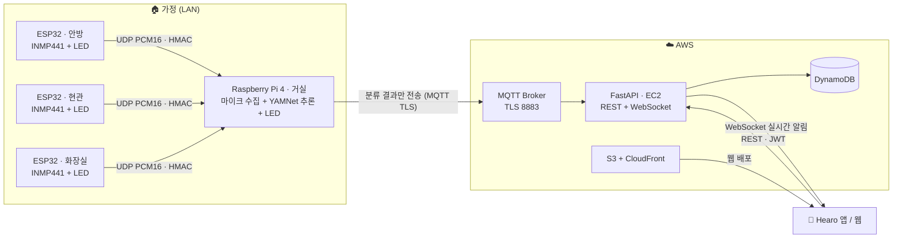
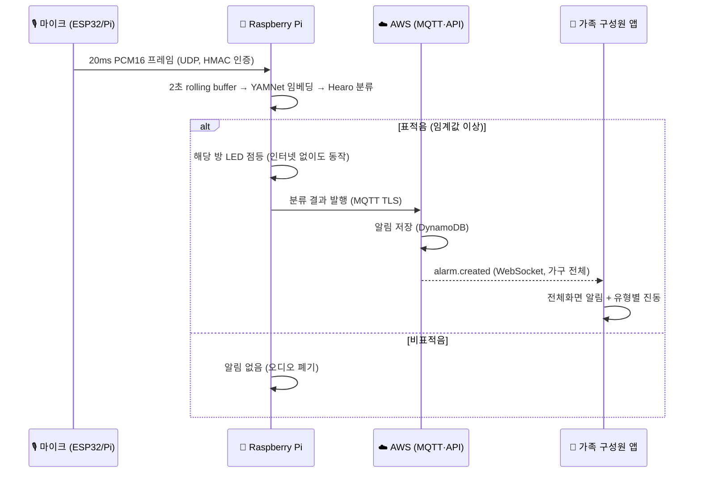

# 🔔 Hearo — 청각장애인을 위한 가정용 환경음 인식 IoT 알림 시스템


> **"들리지 않아도, 놓치지 않도록."**
> 집 안 곳곳의 비상벨·도어락·노크·아기 울음 소리를 엣지 AI가 인식해, 방별 LED와 스마트폰 전체화면 알림·진동으로 즉시 전달하고 119 문자 신고까지 한 번에 연결합니다.

| 한눈에 보기 | |
| --- | --- |
| 🎯 대상 | 가정 내 청각장애인 및 가족·보호자 |
| 🔊 인식 소리 | 비상벨(사이렌 3종) · 도어락(2종) · 노크(2종) · 아기 울음 |
| 🧠 AI | YAMNet 임베딩 + Hearo 전용 9-class 분류기 (TFLite, 약 300KB) |
| 📡 감지 범위 | 거실·안방·현관·화장실 4개 공간 동시 감지 |
| 📱 알림 | 방별 LED · 웹/앱 전체화면 알림 · 유형별 진동 패턴 |
| 🚨 긴급 대응 | 119 문자 신고 · 119 영상통화 요청 · 가족 단체문자 |

### 🗂 저장소 구성

| 저장소 | 역할 | 주요 기술 |
| --- | --- | --- |
| [**frontend**](https://github.com/2026-ITEC0401/frontend) | 사용자 웹앱 | React 19, TypeScript, Vite, Tailwind CSS v4 |
| [**app**](https://github.com/2026-ITEC0401/app) | Android 앱 (스토어 출시용) | React Native, Expo SDK 57, Expo Router, TanStack Query |
| [**backend**](https://github.com/2026-ITEC0401/backend) | API 서버 · 실시간 알림 | FastAPI, DynamoDB, WebSocket, MQTT |
| [**raspberry-pi**](https://github.com/2026-ITEC0401/raspberry-pi) | 엣지 AI 추론 허브 · ESP32 펌웨어 · 모델 학습 | YAMNet, TFLite, Python, ESP32 |
| [**docs**](https://github.com/2026-ITEC0401/docs) | 발표자료 및 산출물 | — |

---

## **💡1. 프로젝트 개요**

### **1-1. 프로젝트 소개**

- **프로젝트 명** : Hearo (히어로) — *Hear* + *Hero*, 소리를 대신 들어주는 조력자
- **프로젝트 정의** : 가정 내 생활·위험 소리를 방마다 설치한 마이크로 수집하고, 라즈베리파이의 엣지 AI가 소리 종류를 판별해 청각장애인에게 시각·촉각 알림으로 전달하는 IoT 시스템

<!-- TODO: 서비스 대표 이미지 (메인 화면 + 실제 설치 기기 사진) -->

### **1-2. 개발 배경 및 필요성**

**① 청각장애는 두 번째로 많은 장애 유형이며, 빠르게 고령화되고 있습니다.**

- 2025년 말 등록장애인은 약 262.8만 명이며, 이 중 **청각장애가 17.1%(약 45만 명)로 지체장애 다음으로 많습니다.**
- 전체 등록장애인의 **56.9%가 65세 이상**이고, 최근 1년간 새로 등록한 65세 이상 장애인의 **46.3%가 청각장애**였습니다.
- 즉 사용자 상당수는 **시력·인지 기능도 함께 저하된 고령층**이며, 알림은 "보이기만 하는 것"이 아니라 **크고, 분명하고, 잘못 누르기 어려워야** 합니다.

> 출처 : 보건복지부 「2025년도 등록장애인 현황」

**② 위험을 알리는 소리는 대부분 '소리'로만 전달됩니다.**

- 화재경보기, 도어락, 노크, 아기 울음은 모두 청각 신호에 의존합니다. 청각장애인에게는 **경보를 놓치는 것이 곧 대피 지연**으로 이어집니다.
- 지자체·소방서에서 시각 경보형 감지기를 보급하고 있지만, **화재 한 가지 상황**에 한정되고 설치된 공간에서만 동작합니다.

**③ 기존 대안은 '한 공간, 한 종류'의 소리만 다룹니다.**

| 기존 대안 | 한계 |
| --- | --- |
| 시각 경보형 화재감지기 | 화재 경보만 감지, 설치된 방에서만 확인 가능 |
| 초인종 연동 플래셔 | 해당 기기 1종에만 연동, 노크·아기 울음 미지원 |
| 스마트폰 소리 인식 기능 | 휴대폰이 곁에 있을 때 그 위치의 소리만 감지, 가족 공유 불가 |
| CCTV·홈캠 | 영상 기반이라 소리 이벤트 판별 불가, 사생활 부담 |

→ **집 전체의 여러 소리를 한 곳에서, 가족과 함께, 즉시 확인할 수 있는 시스템**이 필요합니다.

### **1-3. 프로젝트 특장점**

| 특장점 | 내용 |
| --- | --- |
| 🏠 **방별 분산 감지** | 거실(라즈베리파이)과 안방·현관·화장실(ESP32)에 마이크를 설치해 **어느 방에서 난 소리인지**까지 알림 |
| 🧠 **엣지 AI 추론** | 모든 추론을 집 안의 라즈베리파이에서 수행. **인터넷이 끊겨도 로컬 추론과 LED 알림은 계속 동작** |
| 🔒 **오디오 비저장·비전송** | 음성 데이터는 집 안 LAN에서만 오가며 **클라우드로 전송하지도, 파일로 저장하지도 않음**. 서버에는 분류 결과만 전달 |
| 🛡️ **기기 인증** | ESP32 ↔ 라즈베리파이 오디오 패킷마다 HMAC-SHA256 인증, 클라우드 구간은 MQTT TLS(8883) |
| ⚡ **실시간 다중 전달** | MQTT → AWS → WebSocket으로 같은 가구의 **가족·보호자 모두에게 동시에** 알림 |
| 👁️ **고령 사용자 중심 UI** | 큰 글씨·고대비 색 구분·소리 유형별 진동 패턴·전체화면 알림을 디자인 토큰으로 체계화 |
| 🚨 **신고까지 한 번에** | 비상벨 감지 시 **등록된 주소가 채워진 119 문자 신고**, 영상통화 요청, 가족 단체문자로 바로 연결 |

**기존 대안과의 비교**

| 구분 | 시각 경보형 감지기 | 스마트폰 소리 인식 | **Hearo** |
| --- | :---: | :---: | :---: |
| 감지 소리 종류 | 화재 1종 | 다수 | **4종 (세부 8클래스)** |
| 집 전체 감지 | ✕ | ✕ (휴대폰 위치만) | **○ (4개 공간)** |
| 소리 발생 위치 표시 | ✕ | ✕ | **○** |
| 가족·보호자 공유 | ✕ | ✕ | **○** |
| 인터넷 단절 시 동작 | ○ | ○ | **○ (로컬 LED)** |
| 119 신고 연계 | ✕ | ✕ | **○** |

### **1-4. 주요 기능**

**📱 사용자 앱/웹**

| 기능 | 설명 |
| --- | --- |
| 실시간 소리 알림 | 소리 감지 즉시 **전체화면 팝업** + 유형별 색상·아이콘·**진동 패턴**으로 구분 |
| 방별 기기 현황 | 4개 공간의 기기 연결 상태를 메인 화면에서 실시간 확인 |
| 알림 이력 | 최근 7일 날짜별 이력, **미확인 알림 개수** 배지, 모두 확인 처리 |
| 긴급 대응 | 가구 대표(owner): 119 문자 신고·119 영상통화 요청·가족 단체문자 / 보호자: 119 전화·대표에게 문자 |
| 가족 연동 | 6자리 초대 코드(24시간 유효)로 가족·보호자를 같은 가구에 연결 |
| 기기 키트 등록 | 허브(라즈베리파이) 1대 + 알림 기기(ESP32) 3대로 구성된 키트를 가구에 등록하고 연결 상태 확인 |
| 주소 온보딩 | 행안부 도로명주소 검색으로 긴급 신고용 주소 등록 |
| 설정 | 기기별 LED 설정, 알림 설정, 가족 표시 이름, 비밀번호·프로필 관리, 회원 탈퇴 |
| 스토어 출시 대응 | 이용약관·개인정보 처리방침 동의, 오픈소스 라이선스 고지 |

<!-- TODO: 주요 화면 캡처 (메인 / 전체화면 알림 / 알림 이력 / 긴급 대응 / 기기 설정) -->
<!--
|  |  |  |  |
| :---: | :---: | :---: | :---: |
| 메인 · 방별 기기 현황 | 전체화면 알림 | 7일 알림 이력 | 119 · 가족 연락 |
-->

**🔧 IoT 기기**

| 기능 | 설명 |
| --- | --- |
| 다중 마이크 수집 | 라즈베리파이 1대 + ESP32 3대, 각각 INMP441 마이크로 16kHz 수집 |
| 엣지 소리 분류 | 2초 rolling buffer를 YAMNet + Hearo 분류기로 판별, 클래스별 임계값 적용 |
| 방별 LED 알림 | 소리가 난 방의 LED 점등으로 휴대폰 없이도 확인 가능 |
| 기기 상태 동기화 | heartbeat와 설정 polling으로 연결 상태·LED 설정을 서버와 동기화 |

### **1-5. 기대 효과 및 활용 분야**

**기대 효과**
- **안전** : 화재 경보 등 긴급 소리의 인지 시간을 단축하고, 119 문자 신고까지의 단계를 줄여 대피·신고 지연을 방지
- **독립성** : 방문자·아기 울음 등 일상 소리를 스스로 확인할 수 있어 가족 의존도를 낮춤
- **돌봄 연계** : 떨어져 사는 가족·보호자도 같은 알림을 실시간으로 받아 원격 돌봄 가능
- **프라이버시** : 영상·음성 원본을 외부로 보내지 않아 기존 모니터링 기기의 사생활 부담 해소

**활용 분야**
- 청각장애인·난청 고령자 가정
- 독거 고령자 원격 돌봄 서비스
- 장애인·노인 복지시설, 요양시설의 소리 이벤트 모니터링
- 공공 보급 사업(지자체 시각경보기 보급 사업의 확장형)

### **1-6. 기술 스택**

| 구분 | 기술 |
| --- | --- |
| **Frontend (Web)** | React 19, TypeScript, Vite, Tailwind CSS v4, React Router v7, pnpm |
| **Mobile App** | React Native 0.86, Expo SDK 57, Expo Router, TypeScript, TanStack Query, Zustand, Expo SecureStore, EAS Build |
| **Backend** | Python, FastAPI, WebSocket, JWT(Argon2id), Pydantic |
| **Messaging** | MQTT (Mosquitto, TLS 8883), UDP(LAN, HMAC 인증) |
| **Database** | Amazon DynamoDB |
| **AI** | YAMNet, TensorFlow Lite (dynamic-range quantization), Google Colab |
| **Hardware** | Raspberry Pi 4, ESP32 × 3, INMP441 MEMS 마이크, LED |
| **Infra · CI/CD** | AWS EC2, S3, CloudFront, Nginx, systemd, GitHub Actions |
| **Design · 협업** | Figma, GitHub, ClickUp |

---

## **💡2. 팀원 소개**

<!-- TODO: 프로필 이미지 URL 교체 (이름 기재 X) -->

|  |  |  |  |  |
| :---: | :---: | :---: | :---: | :---: |
| **멘티1** | **멘티2** | **멘티3** | **멘티4** | **멘토** |
| • 프론트엔드 개발<br>• UI/UX 디자인<br>• 웹 배포 자동화 | • 백엔드 개발<br>• AWS 인프라 구축 | • 서비스 기획<br>• 모바일 앱 개발 | • TODO | • 프로젝트 멘토<br>• 기술 자문 |

---

## **💡3. 시스템 구성도**

### **3-1. 서비스 구성도**

<!-- TODO: 발표자료의 구성도 이미지가 있으면 함께 첨부 -->



### **3-2. H/W 구성**

| 기기 ID | 설치 위치 | 역할 |
| --- | --- | --- |
| `rpi-001` | 거실 | 직접 마이크 수집 + ESP32 오디오 수신, YAMNet 추론, LED, 클라우드 발행 |
| `esp32_1` | 안방 | INMP441 수집 → 라즈베리파이로 로컬 전송, LED |
| `esp32_2` | 현관 | INMP441 수집 → 라즈베리파이로 로컬 전송, LED |
| `esp32_3` | 화장실 | INMP441 수집 → 라즈베리파이로 로컬 전송, LED |

<!-- TODO: 실제 설치 기기 사진 (라즈베리파이 + USB 마이크, ESP32 노드) -->

### **3-3. 소리 감지 → 알림 흐름**



### **3-4. AI 모델**

**모델 구조** — 사전학습된 Google **YAMNet**을 특징 추출기로 사용하고, 그 위에 Hearo 전용 경량 분류기를 학습했습니다.

```
16kHz 오디오 ─▶ YAMNet (0.96초 창 · 0.48초 간격) ─▶ 1024차원 임베딩 ─▶ Hearo 분류기 ─▶ 9개 클래스 확률
```

| 사용자 알림 | 세부 학습 클래스 (v3.2) |
| --- | --- |
| 🚨 비상벨소리 | 사이렌 고저교번형 · 완만변조형 · 급속변조형 |
| 🔐 도어락소리 | 도어락 개방음 · 입력음 |
| 🚪 노크소리 | 목재문 노크 · 철재문 노크 |
| 👶 아기울음소리 | 아기 울음 |
| — 알림 없음 | 비표적음 (생활 소음) |

**설계 포인트**
- **비표적음 클래스를 함께 학습**해 TV·대화·생활 소음이 알림으로 새는 비율(false-alert)을 직접 측정하고 제한
- **클래스별 임계값**을 적용해 위험도가 다른 소리마다 민감도를 따로 조정
- 같은 원본에서 나온 잘라낸 파일·증강본은 같은 `group_id`로 묶어 **train/validation/test 간 누수를 차단**

**성능 (v2 모델, 격리 test set 기준)**

| 지표 | 결과 |
| --- | --- |
| 표적 9클래스 macro-F1 | **78.77%** |
| 비표적음 오알림률 (false-alert rate) | **0.80%** |
| 전체 정확도 | 97.37% |
| 모델 크기 (TFLite 양자화) | **304,784 bytes** (float32 대비 약 74% 감소, 동일 성능 유지) |

> 전체 정확도는 비표적음 비중이 큰 불균형 데이터의 영향을 받으므로, 표적 macro-F1과 오알림률을 핵심 지표로 사용했습니다. 현재 운영 모델은 클래스 체계를 개선한 v3.2입니다.
> 상세 결과 : [v2 평가 보고서](https://github.com/2026-ITEC0401/raspberry-pi/blob/main/yamnet/docs/v2-evaluation.md)

<p align="center">
  
  
</p>

### **3-5. 데이터 설계**

| 테이블 | 키 | 설계 이유 |
| --- | --- | --- |
| 알림 (alerts) | PK `household_id` / SK `UTC timestamp#event_id` | 가구별 최근 7일 이력을 **Scan 없이 Query 한 번**으로 조회 |
| 알림 GSI | `household_id#event_id` | 알림 상세를 바로 조회 |
| 구성원 관계 (core) | `HOUSE#{id}` / `MEMBER#{id}` | 구성원별 **마지막 확인 시각**만 저장해 미확인 개수 계산 (알림마다 읽음 필드를 두지 않음) |

---

## **💡4. 작품 소개영상**

<!-- TODO: 유튜브 썸네일·링크로 교체 -->
[](유튜브 영상 URL)

---

## **💡5. 핵심 소스코드**

### **5-1. 유형별 전체화면 알림과 진동 패턴** — [`frontend/.../FullScreenAlert.tsx`](https://github.com/2026-ITEC0401/frontend/blob/develop/src/components/FullScreenAlert.tsx) · [`app/.../full-screen-alert.tsx`](https://github.com/2026-ITEC0401/app/blob/develop/src/components/alert/full-screen-alert.tsx)

청각장애인은 알림음을 들을 수 없고, 고령 사용자는 작은 배너를 놓치기 쉽습니다. 그래서 소리가 감지되면 **화면 전체를 유형별 색으로 덮고**, **진동 패턴을 유형마다 다르게** 해 화면을 보지 않아도 손끝으로 소리 종류를 구분할 수 있게 했습니다. 웹은 Web Vibration API, 앱은 React Native `Vibration`으로 **같은 패턴**을 사용합니다.

| 소리 유형 | 배경색 | 진동 패턴 (ms) | 의도 |
| --- | --- | --- | --- |
| 비상벨 | 빨강 | `500-200-500-200-500` | 길고 반복적 → 즉시 행동 |
| 도어락 | 파랑 | `200-100-200` | 짧은 두 번 → 방문 확인 |
| 아기 울음 | 노랑 | `300` | 한 번 → 주의 환기 |

```tsx
const ALERT_POPUP_CONFIG = {
  Urgent:  { bgColor: "bg-red-200",    title: "비상벨소리 울림", vibratePattern: [500, 200, 500, 200, 500] },
  Visitor: { bgColor: "bg-blue-200",   title: "도어락 열림",     vibratePattern: [200, 100, 200] },
  Noise:   { bgColor: "bg-yellow-200", title: "아기 울음 소리",  vibratePattern: [300] },
};

useEffect(() => {
  if (!config) return;
  document.body.style.overflow = "hidden";          // 알림 확인 전 뒤 화면 조작 방지
  if (navigator.vibrate) navigator.vibrate(config.vibratePattern);

  return () => {
    document.body.style.overflow = "auto";
    if (navigator.vibrate) navigator.vibrate(0);     // 닫으면 진동 즉시 중지
  };
}, [config]);
```

### **5-2. 권한별 긴급 대응 — 119 문자 신고 자동 작성** — [`frontend/src/constants/emergency.ts`](https://github.com/2026-ITEC0401/frontend/blob/develop/src/constants/emergency.ts) · [`EmergencyActions.tsx`](https://github.com/2026-ITEC0401/frontend/blob/develop/src/components/EmergencyActions.tsx)

청각장애인은 119에 음성 전화를 걸기 어렵습니다. 비상벨이 감지되면 **등록된 주소와 감지 시각이 미리 채워진 신고 문자**를 버튼 한 번으로 보낼 수 있게 했습니다. 문자앱을 여는 `sms:` 방식을 택해 통신사 문자 신고 경로를 그대로 사용합니다.

| 설계 결정 | 이유 |
| --- | --- |
| 신고 대상은 119로 통일 | 화재·구급 모두 대응 가능, 여러 번호 사이에서 고민할 필요 제거 |
| "화재"가 아닌 "비상벨·경보음 감지"로 표현 | AI가 화재 여부까지 판단하는 것은 아니므로 상황실에 사실만 전달 |
| 영상통화 요청은 별도 버튼 | 신고 템플릿과 섞이면 상황실에서 혼동할 수 있음 |
| 대표(owner)·보호자 버튼 분리 | 집에 있는 당사자는 신고, 떨어진 보호자는 전화·연락에 집중 |

```ts
export const EMERGENCY_NUMBER = "119";

export function buildReportBody(address: EmergencyAddress, stamp: string, sound: string): string {
  return [
    "[긴급] 청각장애인 비상벨·경보음 감지",
    `주소: ${address.road_address}, ${address.detail_address}`,
    `상황: ${stamp} ${sound} 감지됨`,
    "청각장애인으로 통화 불가. 문자로 연락 바랍니다.",
  ].join("\n");
}
```

### **5-3. 실시간 알림 수신 (WebSocket)** — [`frontend/src/lib/ws.ts`](https://github.com/2026-ITEC0401/frontend/blob/develop/src/lib/ws.ts)

가구 단위 채널에 접속해 토큰으로 인증한 뒤, 메시지 타입별로 신규 알림·기기 목록·기기 상태 변경을 분기합니다. 알 수 없는 타입이나 손상된 프레임은 무시해 **알림 화면이 오류로 멈추지 않도록** 했습니다.

```ts
export function connectWs(
  household_id: string,
  onAlarm: (alarm: AlertRealtime) => void,
  onDevices: (devices: RoomDevice[]) => void,
  onDeviceStatus: (device_id: string, ui_status: DeviceUiStatus) => void,
) {
  const ws = new WebSocket(`${WS_BASE_URL}/ws/households/${household_id}`);

  ws.onopen = () => {
    ws.send(JSON.stringify({ type: "auth", access_token: getAccessToken() }));
  };

  ws.onmessage = (event) => {
    let msg;
    try {
      msg = JSON.parse(event.data);
    } catch {
      return; // JSON이 아닌 프레임은 무시
    }

    if (msg.type === "alarm.created") onAlarm(msg.alarm);
    else if (msg.type === "connection.ready") onDevices(msg.devices);
    else if (msg.type === "device.status_changed") onDeviceStatus(msg.device_id, msg.ui_status);
  };
  return ws;
}
```

### **5-4. 앱 실시간 소켓 — 백그라운드 복귀 재연결과 캐시 동기화** — [`app/src/hooks/use-household-socket.ts`](https://github.com/2026-ITEC0401/app/blob/develop/src/hooks/use-household-socket.ts)

웹을 앱으로 옮기면서 두 가지를 개선했습니다. 첫째, 웹은 화면마다 소켓을 열었지만 앱은 **항상 마운트된 홈 탭에서 하나만 열고**, 받은 기기 상태를 TanStack Query 캐시에 써넣어 모든 화면이 같은 데이터를 봅니다. 둘째, 모바일 OS는 **백그라운드에서 소켓을 끊을 수 있어** 앱이 다시 활성화되면 닫힌 소켓을 자동으로 다시 엽니다. 같은 알림을 중복 수신해도 미확인 개수는 한 번만 올라갑니다.

```ts
const countedAlarmIds = new Set<string>();   // 중복 수신 시 이중 카운트 방지

const connect = () => {
  socket = connectHouseholdSocket(householdId, {
    onAlarm: (alarm) => {
      if (!countedAlarmIds.has(alarm.id)) {
        countedAlarmIds.add(alarm.id);
        queryClient.setQueryData<UnreadCountResponse>(unreadKey, (old) =>
          old ? { ...old, unread_count: old.unread_count + 1 } : old,
        );
      }
      onAlarmRef.current?.(toWebDataFromRealtime(alarm));
    },
    onDevices: (devices) => queryClient.setQueryData(devicesKey, { devices }),
  });
};

connect();

// 백그라운드에서 끊긴 소켓을 포그라운드 복귀 시 다시 연결
const subscription = AppState.addEventListener("change", (state) => {
  const closed = !socket || socket.readyState === WebSocket.CLOSING || socket.readyState === WebSocket.CLOSED;
  if (state === "active" && closed) connect();
});
```

### **5-5. ESP32 ↔ 라즈베리파이 오디오 인증 프로토콜** — [`raspberry-pi/hearo_audio_protocol.py`](https://github.com/2026-ITEC0401/raspberry-pi/blob/main/hearo_audio_protocol.py)

집 안의 소리가 외부로 나가지 않도록 오디오는 **같은 LAN의 라즈베리파이로만** 보냅니다. 같은 네트워크의 다른 기기가 가짜 소리를 주입해 오알림을 일으키지 못하도록, 20ms 프레임마다 **CRC32(손상 검출)와 HMAC-SHA256(기기 인증)**을 검증합니다.

```python
def decode_audio_packet(datagram: bytes, pre_shared_key: str | bytes) -> AudioPacket:
    # ... 헤더 파싱 (magic, version, sequence, sample_rate, device_id, crc)

    if sample_rate != SAMPLE_RATE:
        raise AudioProtocolError(f"지원하지 않는 sample rate입니다: {sample_rate}")
    if zlib.crc32(payload) & 0xFFFFFFFF != expected_crc:
        raise AudioProtocolError("PCM payload CRC가 일치하지 않습니다.")

    expected_tag = hmac.new(
        _key_bytes(pre_shared_key), prefix + payload, hashlib.sha256
    ).digest()[:AUTH_TAG_BYTES]
    if not hmac.compare_digest(tag, expected_tag):   # 타이밍 공격을 막는 상수 시간 비교
        raise AudioProtocolError("오디오 HMAC 인증에 실패했습니다.")
```

### **5-6. 그 외 핵심 코드**

| 영역 | 파일 | 설명 |
| --- | --- | --- |
| 엣지 추론 메인 | [`raspberry-pi/appAWS_v3_2.py`](https://github.com/2026-ITEC0401/raspberry-pi/blob/main/appAWS_v3_2.py) | YAMNet v3.2 추론 · LED · MQTT · ESP32 오디오 허브 |
| 모델 런타임 | [`raspberry-pi/hearo_model_runtime.py`](https://github.com/2026-ITEC0401/raspberry-pi/blob/main/hearo_model_runtime.py) | 시작 시 메타데이터·클래스 순서·입출력 shape 검증 후 추론 |
| 오디오 수신 | [`raspberry-pi/hearo_audio_receiver.py`](https://github.com/2026-ITEC0401/raspberry-pi/blob/main/hearo_audio_receiver.py) | 기기별 2초 rolling buffer와 추론 큐 |
| 모델 학습 | [`yamnet_fine_tuning_colab_paper_v3_2.ipynb`](https://github.com/2026-ITEC0401/raspberry-pi/blob/main/yamnet/yamnet_fine_tuning_colab_paper_v3_2.ipynb) | 그룹 단위 데이터 분할, 클래스별 임계값 선정 |
| API 서버 | [`backend/hearo_backend/main.py`](https://github.com/2026-ITEC0401/backend/blob/main/hearo_backend/main.py) | REST 라우트, 인증·권한, WebSocket |
| MQTT 브리지 | [`backend/hearo_backend/mqtt_bridge.py`](https://github.com/2026-ITEC0401/backend/blob/main/hearo_backend/mqtt_bridge.py) | 기기 상태·알림을 내부 API로 전달 |
| 앱 API 계층 | [`app/src/api/client.ts`](https://github.com/2026-ITEC0401/app/blob/develop/src/api/client.ts) | axios 클라이언트, 토큰 SecureStore 보관 |
| 앱 기기 키트 | [`app/src/app/device-kit/`](https://github.com/2026-ITEC0401/app/blob/develop/src/app/device-kit) | 키트 미리보기 → 확인 → 등록 결과 흐름 |
| 웹 API 요청 계층 | [`frontend/src/lib/api.ts`](https://github.com/2026-ITEC0401/frontend/blob/develop/src/lib/api.ts) | 제네릭 `request<T>()`, 401 시 토큰 자동 갱신 후 1회 재시도 |

---

## **💡6. 개발 과정에서 해결한 문제**

| 문제 | 해결 |
| --- | --- |
| 생활 소음이 알림으로 오인식될 위험 | 비표적음 클래스를 별도로 학습하고 오알림률을 핵심 지표로 관리 (0.80%) |
| 라즈베리파이에서의 추론 부담 | YAMNet 임베딩 + 경량 분류기 구조, TFLite 양자화로 모델 크기 약 74% 감소 |
| 데이터 누수로 성능이 부풀려지는 문제 | 같은 원본의 증강본을 `group_id`로 묶어 분할 단위를 원본 그룹으로 통일 |
| 인터넷 장애 시 알림 중단 | 추론과 LED를 로컬에서 수행해 클라우드 연결과 무관하게 동작 |
| 프로토타입(Firebase)의 확장 한계 | FastAPI + DynamoDB + WebSocket 기반 AWS 아키텍처로 전환 |
| 프론트엔드 유지보수성 | JavaScript → TypeScript 전면 마이그레이션, 디자인 토큰 체계화, GitHub Actions로 S3·CloudFront 자동 배포 |
| 웹을 앱으로 옮길 때의 실시간 연결 문제 | 소켓을 하나로 통합하고 TanStack Query 캐시로 공유, 백그라운드 복귀 시 자동 재연결 |
| 스토어 출시 요건 | 패키지명·아이콘·스플래시 확정, EAS 빌드 설정, 약관·개인정보 처리방침·오픈소스 고지 화면 구현 |

---

## **🏆 수상 및 성과**

- 2026.06 한국정보기술학회 하계종합학술대회 대학생 논문경진대회 **동상**
- 2026 한이음 ICT 멘토링 **우수 프로젝트 선정**
